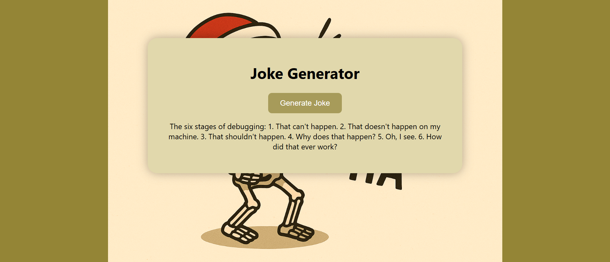

# 😂 Joke Generator App

A simple **Node.js + Express + EJS** application that fetches random jokes from the [JokeAPI](https://jokeapi.dev/).  
The app displays jokes dynamically on the frontend with a clean and minimal UI.

---

## 🚀 Features
- Fetches random jokes from JokeAPI using **Axios**
- Uses **Express.js** as the backend framework
- **EJS templating engine** for rendering HTML
- Static assets served from the `public/` folder
- Error handling for API failures

---

## 🛠️ Tech Stack
- **Node.js**
- **Express.js**
- **EJS**
- **Axios**

---

## 📸 Screenshot  

  

---
🚀 Installation & Setup

# Clone repository
git clone https://github.com/Farwa-Khalid/Joke-Generator-App.git
cd joke-project

# Install dependencies
npm install
npm i nodemon 

# Run the app
nodemon index.js

